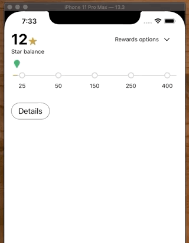
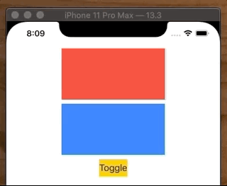
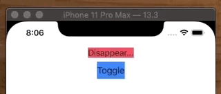
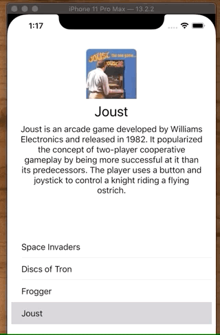

# Animations

## Property Animations



_UIView.animate_ is still fine to use, but the new Property animators are the way to go.

**Old**

```swift
UIView.animate(withDuration: 0.75) { [unowned self] in
    self.heightConstraint?.constant = 270
    self.layoutIfNeeded()
}

UIView.animate(withDuration: 0.25, delay: 0.5, options: [], animations: {
    self.starRewardsView.isHidden = false
    self.starRewardsView.alpha = 1
}) { (finished) in

}
```

**New**

```swift
let animator1 = UIViewPropertyAnimator(duration: 0.75, curve: .easeInOut) {
    self.heightConstraint?.constant = 270
    self.layoutIfNeeded()
}
animator1.startAnimation()

let animator2 = UIViewPropertyAnimator(duration: 0.25, curve: .easeInOut) {
    self.starRewardsView.isHidden = false
    self.starRewardsView.alpha = 1
}
animator2.startAnimation(afterDelay: 0.5)
```

## Animating the height

To animate things you need to change the constraint constant. In this example we can adjust the height. Note we need to call `layoutIfNeeded()` where as in a _Stack View_ we dont.



```swift
import UIKit

class ViewController: UIViewController {

    let redView = UIView()
    let blueView = UIView()
    let button = UIButton()
    
    var heightConstraint: NSLayoutConstraint?
    
    override func viewDidLoad() {
        super.viewDidLoad()
        style()
        layout()
    }
    
    func layout() {
    	...
        heightConstraint = redView.heightAnchor.constraint(equalToConstant: 100)
        ...
    }
    
    @objc func toggleTapped() {
        if heightConstraint?.constant == 0 {
            UIView.animate(withDuration: 0.75) { [unowned self] in
                self.heightConstraint?.constant = 100
                self.view.layoutIfNeeded()
            }
        } else {
            UIView.animate(withDuration: 0.75) { [unowned self] in
                self.heightConstraint?.constant = 0
                self.view.layoutIfNeeded()
            }
        }
    }
}
```


## Animating within a Stack View

StackView will animate your contents for you when you change their visibility and alpha.



```swift
func layout() {
    stackView.addArrangedSubview(label)
    
    view.addSubview(stackView)
    view.addSubview(button)
    
    ...
}
    
@objc func toggleTapped() {
    UIView.animate(withDuration: 0.75) { [unowned self] in
        self.label.isHidden = !self.label.isHidden
        self.label.alpha = self.label.isHidden ? 0 : 1
    }
}
```


## Animating the alpha

Here are two ways you can animate some controls when a user taps a `UITableView` row.



```swift
UIView.animate(withDuration: 3) {
    self.profileImage.image = UIImage(named: game.imageName)
    self.titleLabel.text = game.name
    self.bodyLabel.text = game.description

    self.profileImage.alpha = 1
    self.titleLabel.alpha = 1
    self.bodyLabel.alpha = 1

    self.view.layoutIfNeeded()
}

UIViewPropertyAnimator.runningPropertyAnimator(withDuration: 3, delay: 0, options: [], animations: {
    self.profileImage.image = UIImage(named: game.imageName)
    self.titleLabel.text = game.name
    self.bodyLabel.text = game.description

    self.profileImage.alpha = 1
    self.titleLabel.alpha = 1
    self.bodyLabel.alpha = 1
})
```

### Links that help

- [Quick Guide To Property Animators](https://useyourloaf.com/blog/quick-guide-to-property-animators/)
