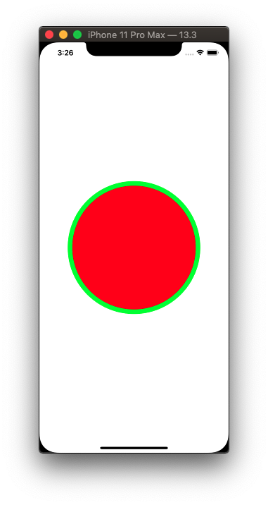
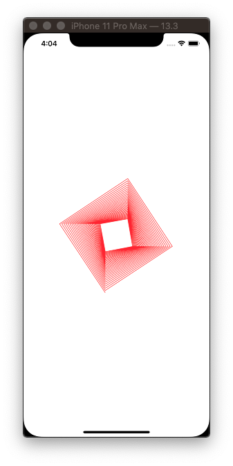
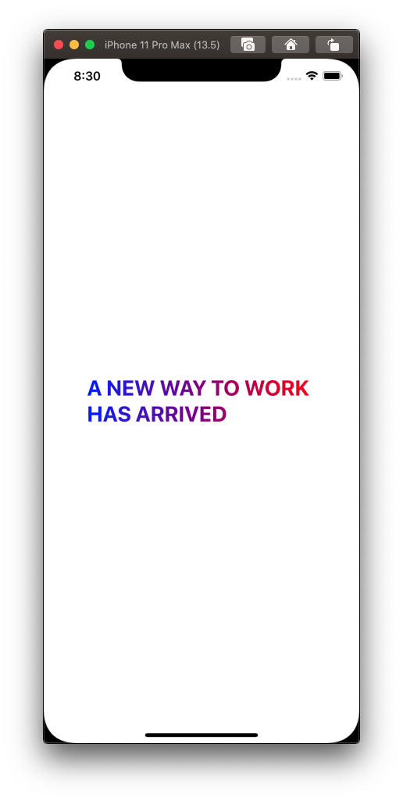

# Draw

## Rectangle with border


```swift
func drawRectangle() {
    let renderer = UIGraphicsImageRenderer(size: CGSize(width: 300, height: 300))
    
    let img = renderer.image { ctx in
        let rectangle = CGRect(x: 0, y: 0, width: 300, height: 300)
        
        ctx.cgContext.setFillColor(UIColor.red.cgColor)
        ctx.cgContext.setStrokeColor(UIColor.green.cgColor)
        ctx.cgContext.setLineWidth(10)

        ctx.cgContext.addRect(rectangle)
        ctx.cgContext.drawPath(using: .fillStroke)
    }
    
    imageView.image = img
}
```

## Rectangle with no border


```swift
func drawRectangle2() {
    let renderer = UIGraphicsImageRenderer(size: CGSize(width: 300, height: 300))
    
    let img = renderer.image { ctx in
        ctx.cgContext.setFillColor(UIColor.red.cgColor)
        ctx.cgContext.fill(CGRect(x: 0, y: 0, width: 300, height: 300))
    }
    
    imageView.image = img
}
```

## Circle



```swift
func drawCircle() {
    let renderer = UIGraphicsImageRenderer(size: CGSize(width: 300, height: 300))
    
    let img = renderer.image { ctx in
        ctx.cgContext.setFillColor(UIColor.red.cgColor)
        ctx.cgContext.setStrokeColor(UIColor.green.cgColor)
        ctx.cgContext.setLineWidth(10)

        let rectangle = CGRect(x: 0, y: 0, width: 300, height: 300).inset(by: UIEdgeInsets(top: 10, left: 10, bottom: 10, right: 10))
        ctx.cgContext.addEllipse(in: rectangle)
        ctx.cgContext.drawPath(using: .fillStroke)
    }
    
    imageView.image = img
}
```

	> Note: Circles need to be inset because they draw up to rectangle edge

## Rotated square


```swift
func drawRotatedSquare() {
    let renderer = UIGraphicsImageRenderer(size: CGSize(width: 256, height: 256))
    
    let img = renderer.image { ctx in
        
        ctx.cgContext.translateBy(x: 128, y: 128)
        let rotations = 16
        let amount = Double.pi / Double(rotations)
        
        // add 16 rotated rectangles
        for _ in 0 ..< rotations {
            ctx.cgContext.rotate(by: CGFloat(amount))
            ctx.cgContext.addRect(CGRect(x: -64, y: -64, width: 128, height: 128))
        }
        
        ctx.cgContext.setStrokeColor(UIColor.systemRed.cgColor)
        ctx.cgContext.strokePath()
    }
    
    imageView.image = img
}
```

## Draw lines



```swift
func drawLines() {
    let renderer = UIGraphicsImageRenderer(size: CGSize(width: 256, height: 256))
    
    let img = renderer.image { ctx in
        ctx.cgContext.translateBy(x: 128, y: 128)
        
        var first = true
        var length: CGFloat = 128
        
        for _ in 0 ..< 128 {
            ctx.cgContext.rotate(by: .pi / 2)
            if first {
                ctx.cgContext.move(to: CGPoint(x: length, y: 25))
                first = false
            } else {
                ctx.cgContext.addLine(to: CGPoint(x: length, y: 25))
            }
            
            length *= 0.99
        }
        
        ctx.cgContext.setStrokeColor(UIColor.systemRed.cgColor)
        ctx.cgContext.strokePath()
    }
    
    imageView.image = img
}
```

## Text and images


```swift
func drawImagesAndText() {
    let renderer = UIGraphicsImageRenderer(size: CGSize(width: 256, height: 256))
    
    let img = renderer.image { ctx in
        let paragraphStyle = NSMutableParagraphStyle()
        paragraphStyle.alignment = .center
        
        let attrs: [NSAttributedString.Key: Any] = [
            .font: UIFont.preferredFont(forTextStyle: .title1),
            .paragraphStyle: paragraphStyle
        ]
        
        let string = "The best laid schemes of mince and men"
        
        let attributedString = NSAttributedString(string: string, attributes: attrs)
        attributedString.draw(with: CGRect(x: 32, y: 32, width: 200, height: 200), options: .usesLineFragmentOrigin, context: nil)
        
        let star = UIImage(named: "star")
        star?.draw(at: CGPoint(x: 124, y: 150))
    }
    
    imageView.image = img
}
```

## Auto Layout

```swift
import UIKit

class GraphView: UIView {
    
    let imageView = UIImageView()
    
    override init(frame: CGRect) {
        super.init(frame: .zero)
        backgroundColor = .systemYellow
        layout()
    }
    
    required init?(coder: NSCoder) {
        fatalError("init(coder:) has not been implemented")
    }

    func layout() {
        imageView.translatesAutoresizingMaskIntoConstraints = false
        
        drawRectangle()
        
        addSubview(imageView)
        
        NSLayoutConstraint.activate([
            imageView.centerXAnchor.constraint(equalTo: centerXAnchor),
            imageView.centerYAnchor.constraint(equalTo: centerYAnchor),
        ])
    }

    func drawRectangle() { ... }
}
```

## Gradient on Text



```swift
import UIKit

class ViewController: UIViewController {

    let label = UILabel()

    override func viewDidLoad() {
        super.viewDidLoad()
        style()
        layout()
    }

    func style() {
        label.translatesAutoresizingMaskIntoConstraints = false
        label.font = UIFont.preferredFont(forTextStyle: .title1).bold()
        label.numberOfLines = 0
        label.lineBreakMode = .byWordWrapping

        label.text = "A NEW WAY TO WORK HAS ARRIVED"

        if label.applyGradientWith(startColor: .red, endColor: .blue) {
            print("Gradient applied!")
        }
        else {
            print("Could not apply gradient")
            label.textColor = .black
        }
    }

    func layout() {
        view.addSubview(label)

        NSLayoutConstraint.activate([
            label.centerXAnchor.constraint(equalTo: view.centerXAnchor),
            label.centerYAnchor.constraint(equalTo: view.centerYAnchor),
            label.widthAnchor.constraint(equalToConstant: 300)
        ])
    }
}

extension UILabel {

    func applyGradientWith(startColor: UIColor, endColor: UIColor) -> Bool {

        var startColorRed:CGFloat = 0
        var startColorGreen:CGFloat = 0
        var startColorBlue:CGFloat = 0
        var startAlpha:CGFloat = 0

        if !startColor.getRed(&startColorRed, green: &startColorGreen, blue: &startColorBlue, alpha: &startAlpha) {
            return false
        }

        var endColorRed:CGFloat = 0
        var endColorGreen:CGFloat = 0
        var endColorBlue:CGFloat = 0
        var endAlpha:CGFloat = 0

        if !endColor.getRed(&endColorRed, green: &endColorGreen, blue: &endColorBlue, alpha: &endAlpha) {
            return false
        }

        let gradientText = self.text ?? ""

        let textSize: CGSize = gradientText.size(withAttributes:
            [NSAttributedString.Key.font: self.font as Any])
        let width:CGFloat = textSize.width
        let height:CGFloat = textSize.height

        UIGraphicsBeginImageContext(CGSize(width: width, height: height))

        guard let context = UIGraphicsGetCurrentContext() else {
            UIGraphicsEndImageContext()
            return false
        }

        UIGraphicsPushContext(context)

        let glossGradient:CGGradient?
        let rgbColorspace:CGColorSpace?
        let num_locations:size_t = 2
        let locations:[CGFloat] = [ 0.0, 1.0 ]
        let components:[CGFloat] = [startColorRed, startColorGreen, startColorBlue, startAlpha, endColorRed, endColorGreen, endColorBlue, endAlpha]
        rgbColorspace = CGColorSpaceCreateDeviceRGB()
        glossGradient = CGGradient(colorSpace: rgbColorspace!, colorComponents: components, locations: locations, count: num_locations)
        let topCenter = CGPoint.zero
//        let bottomCenter = CGPoint(x: 0, y: textSize.height) // top > bottom
        let bottomCenter = CGPoint(x: textSize.width, y: 0) // left > right
        context.drawLinearGradient(glossGradient!, start: topCenter, end: bottomCenter, options: CGGradientDrawingOptions.drawsBeforeStartLocation)

        UIGraphicsPopContext()

        guard let gradientImage = UIGraphicsGetImageFromCurrentImageContext() else {
            UIGraphicsEndImageContext()
            return false
        }

        UIGraphicsEndImageContext()

        self.textColor = UIColor(patternImage: gradientImage)

        return true
    }

}

extension UIFont {
    func withTraits(traits: UIFontDescriptor.SymbolicTraits) -> UIFont {
        let descriptor = fontDescriptor.withSymbolicTraits(traits)
        return UIFont(descriptor: descriptor!, size: 0) //size 0 means keep the size as it is
    }

    func bold() -> UIFont {
        return withTraits(traits: .traitBold)
    }
}
```

### Links that help

- [Paul Hudson series](https://www.youtube.com/watch?v=vzXl0MhVXxY&feature=youtu.be)
- [Gradient](https://stackoverflow.com/questions/1266179/how-do-i-add-a-gradient-to-the-text-of-a-uilabel-but-not-the-background)
