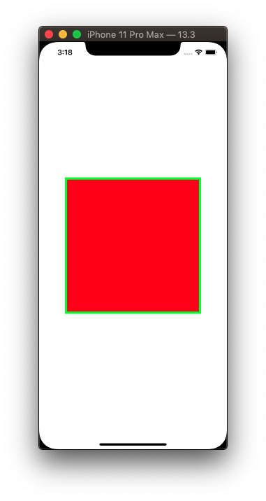
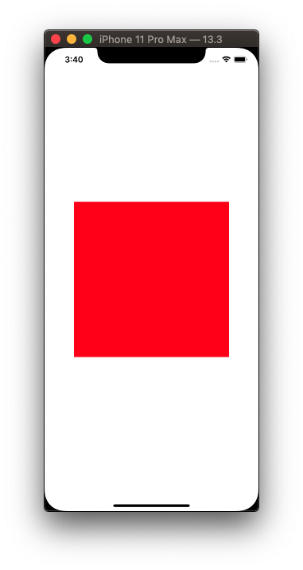
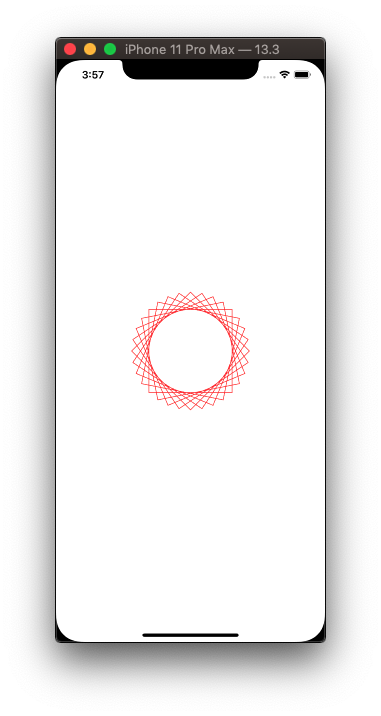

# Draw

## Rectangle with border



```swift
func drawRectangle() {
    let renderer = UIGraphicsImageRenderer(size: CGSize(width: 300, height: 300))
    
    let img = renderer.image { ctx in
        let rectangle = CGRect(x: 0, y: 0, width: 300, height: 300)
        
        ctx.cgContext.setFillColor(UIColor.red.cgColor)
        ctx.cgContext.setStrokeColor(UIColor.green.cgColor)
        ctx.cgContext.setLineWidth(10)

        ctx.cgContext.addRect(rectangle)
        ctx.cgContext.drawPath(using: .fillStroke)
    }
    
    imageView.image = img
}
```

## Rectangle with no border



```swift
func drawRectangle2() {
    let renderer = UIGraphicsImageRenderer(size: CGSize(width: 300, height: 300))
    
    let img = renderer.image { ctx in
        ctx.cgContext.setFillColor(UIColor.red.cgColor)
        ctx.cgContext.fill(CGRect(x: 0, y: 0, width: 300, height: 300))
    }
    
    imageView.image = img
}
```

## Circle


```swift
func drawCircle() {
    let renderer = UIGraphicsImageRenderer(size: CGSize(width: 300, height: 300))
    
    let img = renderer.image { ctx in
        ctx.cgContext.setFillColor(UIColor.red.cgColor)
        ctx.cgContext.setStrokeColor(UIColor.green.cgColor)
        ctx.cgContext.setLineWidth(10)

        let rectangle = CGRect(x: 0, y: 0, width: 300, height: 300).inset(by: UIEdgeInsets(top: 10, left: 10, bottom: 10, right: 10))
        ctx.cgContext.addEllipse(in: rectangle)
        ctx.cgContext.drawPath(using: .fillStroke)
    }
    
    imageView.image = img
}
```

	> Note: Circles need to be inset because they draw up to rectangle edge

## Rotated square



```swift
func drawRotatedSquare() {
    let renderer = UIGraphicsImageRenderer(size: CGSize(width: 256, height: 256))
    
    let img = renderer.image { ctx in
        
        ctx.cgContext.translateBy(x: 128, y: 128)
        let rotations = 16
        let amount = Double.pi / Double(rotations)
        
        // add 16 rotated rectangles
        for _ in 0 ..< rotations {
            ctx.cgContext.rotate(by: CGFloat(amount))
            ctx.cgContext.addRect(CGRect(x: -64, y: -64, width: 128, height: 128))
        }
        
        ctx.cgContext.setStrokeColor(UIColor.systemRed.cgColor)
        ctx.cgContext.strokePath()
    }
    
    imageView.image = img
}
```

## Draw lines


```swift
func drawLines() {
    let renderer = UIGraphicsImageRenderer(size: CGSize(width: 256, height: 256))
    
    let img = renderer.image { ctx in
        ctx.cgContext.translateBy(x: 128, y: 128)
        
        var first = true
        var length: CGFloat = 128
        
        for _ in 0 ..< 128 {
            ctx.cgContext.rotate(by: .pi / 2)
            if first {
                ctx.cgContext.move(to: CGPoint(x: length, y: 25))
                first = false
            } else {
                ctx.cgContext.addLine(to: CGPoint(x: length, y: 25))
            }
            
            length *= 0.99
        }
        
        ctx.cgContext.setStrokeColor(UIColor.systemRed.cgColor)
        ctx.cgContext.strokePath()
    }
    
    imageView.image = img
}
```


## Auto Layout

```swift
import UIKit

class GraphView: UIView {
    
    let imageView = UIImageView()
    
    override init(frame: CGRect) {
        super.init(frame: .zero)
        backgroundColor = .systemYellow
        layout()
    }
    
    required init?(coder: NSCoder) {
        fatalError("init(coder:) has not been implemented")
    }

    func layout() {
        imageView.translatesAutoresizingMaskIntoConstraints = false
        
        drawRectangle()
        
        addSubview(imageView)
        
        NSLayoutConstraint.activate([
            imageView.centerXAnchor.constraint(equalTo: centerXAnchor),
            imageView.centerYAnchor.constraint(equalTo: centerYAnchor),
        ])
    }

    func drawRectangle() { ... }
}
```


### Links that help

- [Paul Hudson series](https://www.youtube.com/watch?v=vzXl0MhVXxY&feature=youtu.be)
