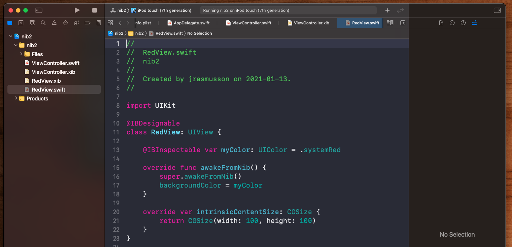

# Working with Nibs

## Loading Nib into View Controller

Simplest thing you can do is create a nib and then associated it with a View Controller.

- Create the nib (same name as view controller).
- Set it's File's Owner to the `ViewController`.
- Point the File's Owner `view` to the nib view


## Loading a Nib into a Nib

Two ways you can go about this:

1. Load the nib manually.
2. Make it `IBDesignable`.

## Nib loading manually

When you want to compose nibs into other nibs, you need to load them manually.

Create a new nib.


Create it's associated view (with the same name).


Associated the view with the nib.


Reference the nib from the parent nib view loading it via the `Bundle` and layout out with Auto Layout.


## Nib loading IBDesignable

To style and load a nib like any other iOS control:

Create your new nib

- Create nib
- Create nib view
- Associate nib with view

Add it to your parent nib as a view

- Add a plain `View` control to the parent
- Associate the plan `View` to your newly create nib view

### Create your new nib

Create a plain old nib.


Create the view backing the nib. Make it `IBDesignable` and give it an intrinsic content size to simplify Auto Layout constraints.



Associate the view with the nib.


Your nib is now good to go.

### Add it your your parent

To add your newly created nib to your parent, drag out a plain old `View` onto your parent nib canvas. Give it some constraints (but don't worry about size).


Then associate this view with the newly created nib view created above.


This will automatically detect that it is `@IBDesignable`, use it's intrinsic content size, and layout it out.


## @IBInspectable

Whatever you set in Interface Builder overrides what you set in code. So when we start our app with my color set to default, the view uses the value set it code and colors the box red.

```swift
import UIKit

@IBDesignable
class RedView: UIView {
    
    @IBInspectable var myColor: UIColor = .systemRed
    
    override func awakeFromNib() {
        super.awakeFromNib()
        backgroundColor = myColor
    }
    
    override var intrinsicContentSize: CGSize {
        return CGSize(width: 100, height: 100)
    }
}
```

But when we set the color in IB, it overrides this and uses the IB value.


## Apple Documentation notes

Xibs

- designed for working with Views
- is an object graph 
- containing views and relationships

File's Owner

- this is a placeholder that you set when you load your nib
- it is the controller for the nib and it receives all the events
- typically you use outlets in the File's Owner to reference objects in the nib

References

- outlets to top level objects can be strong
- while outlets to subviews weak

Each View Controllers Manages its Own Nib File

- UIViewController support the automatically loading of their own associated nib file

Loading Nib Files Programmatically

- NSBundle supports loading of nib files
- loadNibNamed:owner:options: instance method

> Important: You are responsible for releasing the top-level objects of any nib files you load when you are finished with those objects. Failure to do so is a cause of memory leaks in many applications. After releasing the top-level objects, it is a good idea to clear any outlets pointing to objects in the nib file by setting them to nil. You should clear outlets associated with all of the nib file’s objects, not just the top-level objects.

### Links that help
* [Apple Docs Nib Files](https://developer.apple.com/library/archive/documentation/Cocoa/Conceptual/LoadingResources/CocoaNibs/CocoaNibs.html)
