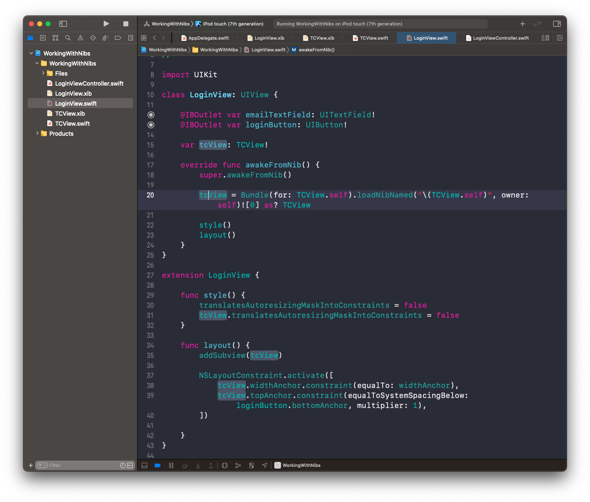
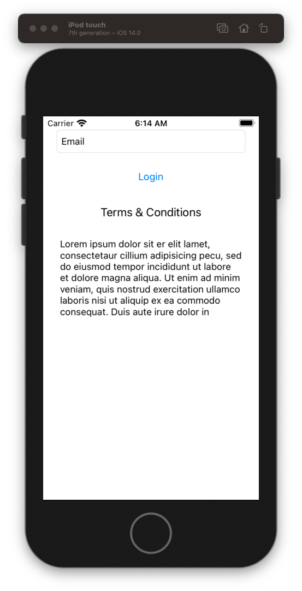

# Working with Nibs

## Nib loading into View Controller

Create a nib `View`.

Optionally turn off Safe Area Layout Guide

Make size Freeform.

Draw and layout controls.

Create a backing View with the same name as the nib (i.e. LoginView).

Associated the view with the nib.

Add the `IBOutlets` by getting both the view and the nib on screen at the same time and control dragging `IBOutlets` from the nib to the view (make them strong references).

Set the File’s owner to be the View Controller.

Register the nib with the View Controllers' `view`.

- Click File’s Owner. 
- In the right-hand sidebar, click on the last tab--the one that looks like a circle with an arrow in it
You should see "outlets" with "view" under it. Drag the circle next to it over to the "view" icon on the left bar (bottom one, looks like a white square with a thick gray outline.

View Controllers know how to load and run associated nibs. So no `Bundle` loading required here.

## Nib loading manually

When you want to compose nibs into other nibs, you need to load them manually.

Create a new nib.

Create it's associated view (with the same name).

Associated the view with the nib.

Reference the nib from the parent nib view loading it via the `Bundle` and layout out with Auto Layout.

## How to make a nib IBDesignable

To make a control `@IBDesignable` you need to add a plain view first, then associated it with the nib you want to display (marked up as @IBDesignable).

### Make `IBDesignable` & `IBInspectable`

Make nib you want to display `@IBDesignable` and `IBInspectable`

Drag out a new view into the nib.

Associated the new view with the designable class. Xcode will update.

And you will now see attribute in inspector pane.

## Apple Documentation notes

Xibs

- designed for working with Views
- is an object graph 
- containing views and relationships

File's Owner

- this is a placeholder that you set when you load your nib
- it is the controller for the nib and it receives all the events
- typically you use outlets in the File's Owner to reference objects in the nib

References

- outlets to top level objects can be strong
- while outlets to subviews weak

Each View Controllers Manages its Own Nib File

- UIViewController support the automatically loading of their own associated nib file

Loading Nib Files Programmatically

- NSBundle supports loading of nib files
- loadNibNamed:owner:options: instance method

> Important: You are responsible for releasing the top-level objects of any nib files you load when you are finished with those objects. Failure to do so is a cause of memory leaks in many applications. After releasing the top-level objects, it is a good idea to clear any outlets pointing to objects in the nib file by setting them to nil. You should clear outlets associated with all of the nib file’s objects, not just the top-level objects.

### Links that help
* [Apple Docs Nib Files](https://developer.apple.com/library/archive/documentation/Cocoa/Conceptual/LoadingResources/CocoaNibs/CocoaNibs.html)
