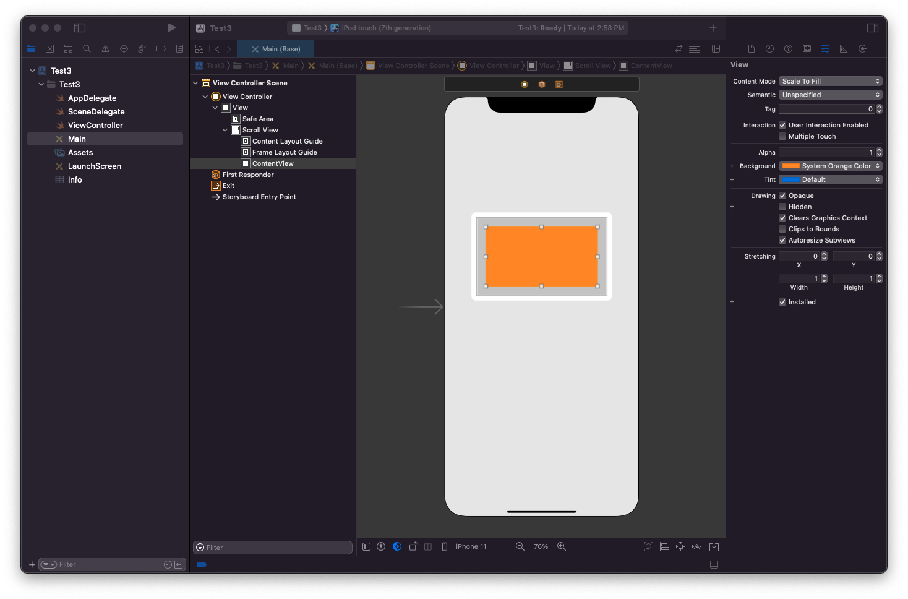
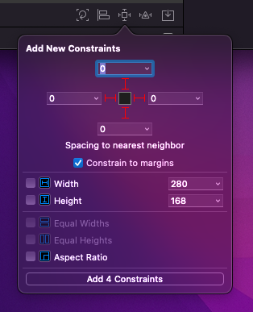
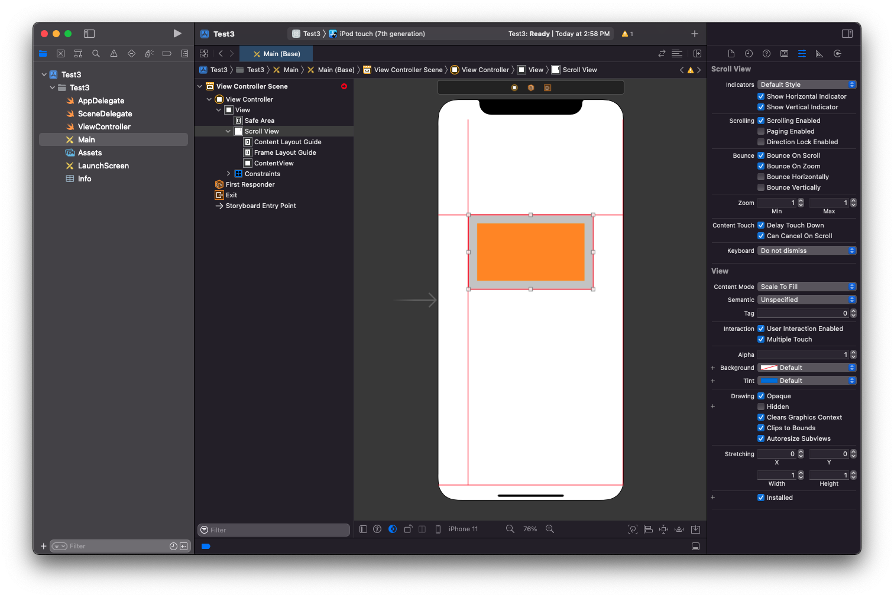
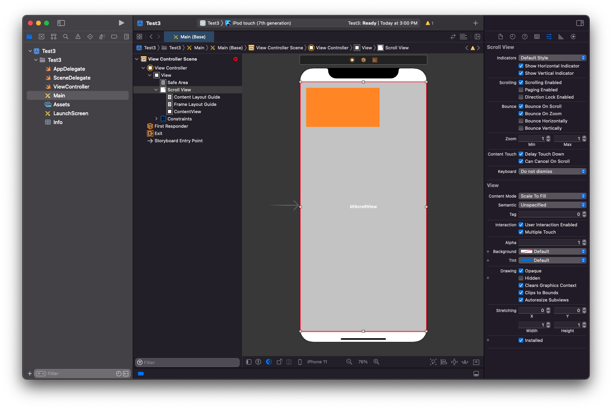
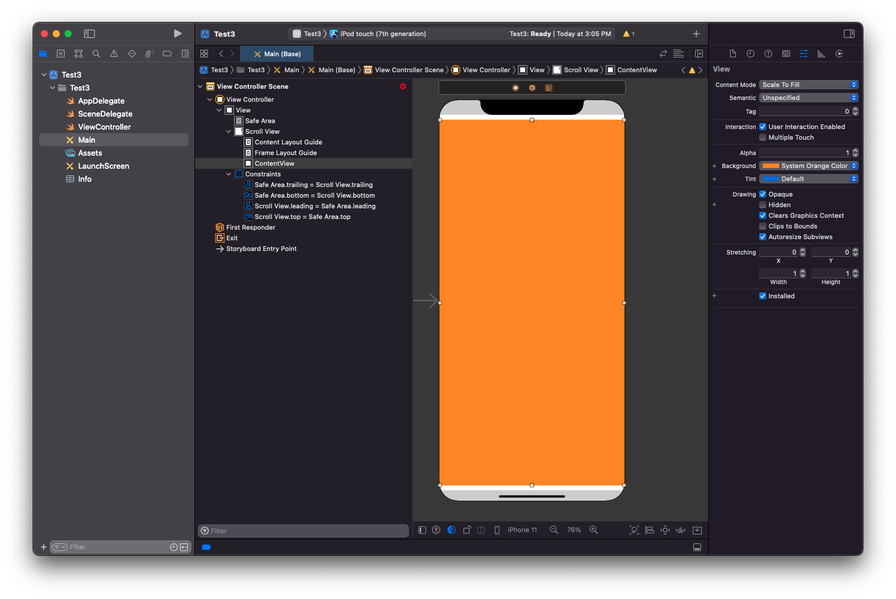
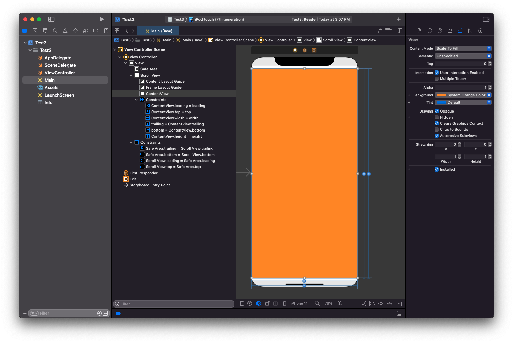
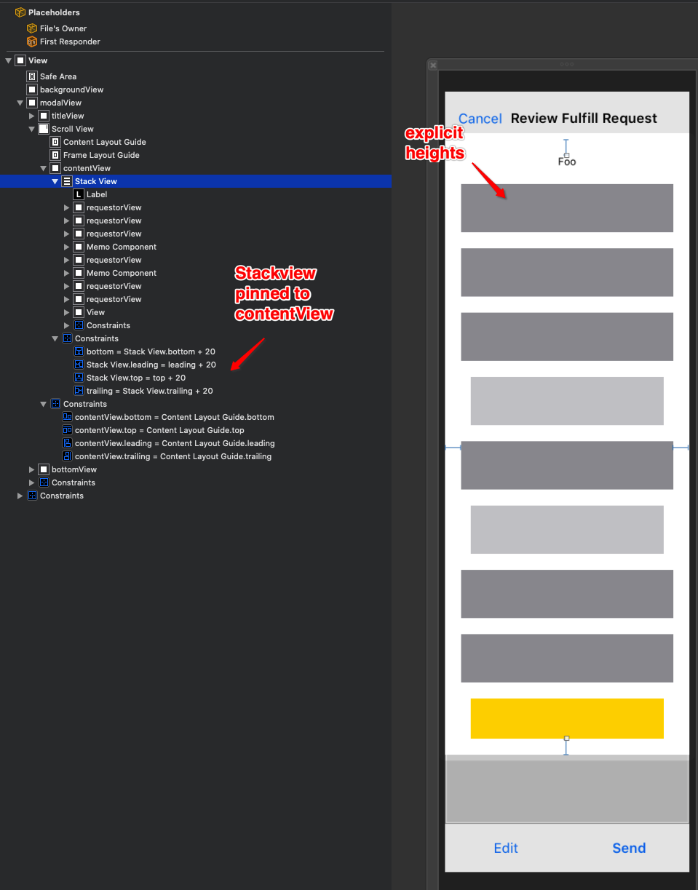
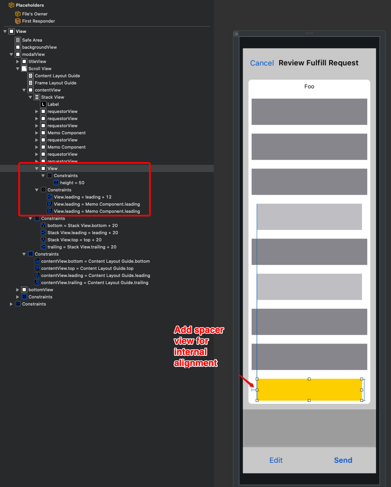

# How to layout a scrollable view

Add a view. Make it orange.

Embed it in a scroll view. Rename it `ContentView`.

Pin the scroll view to the safe areas of the parent.

Drag the scroll view out to the edges so it is flush.

Drag the `ContentView` to the edges of the scroll view so it is flush.

Now add:

- top, leading, trailing, bottom
- width and height

From the `ContentView` to the scroll view by either dragging from one view to the other, or using the attribute anchor near the bottom.

Everything should be flush and perfectly laid out. If it isn't check your constraints and ensure that no extra added spaces or multipliers were added by IB there.

At this point your are done 🎉. Feel free to do your layout in your content view.

## View with a Stack View

The trick with stack views is to give every view within the stack view an explicit height. And then pin the stack view to the edges of the content view.

### Do I need a spacer view?

Not really. The stack view will scroll fine so long as every component inside has an explicit height (greater than won't work here).

The reason you may want to add a spacer view is for alignment within the stack view. If leading alignment doesn't give you want you want, add a custom view, give it some leading and trailing space, and then align your internal stack view elements to that.

### Other tricks

- Stack Views are magical. Adding stack views to stack views can sometimes resolve ambiguity and enable you to use `>=` for height constraints.

### Links that help

* [Manually Scrolling](https://jayeshkawli.ghost.io/manually-scrolling-uiscrollview-ios-swift/)
* [Understanding UIScrollView](https://oleb.net/blog/2014/04/understanding-uiscrollview/)
* [Apple UIScrollView docs](https://developer.apple.com/documentation/uikit/uiscrollview)
* [Human Interface Guidelines](https://developer.apple.com/design/human-interface-guidelines/ios/views/scroll-views/)
* [Auto Layout UIScrollView](https://developer.apple.com/library/archive/documentation/UserExperience/Conceptual/AutolayoutPG/WorkingwithScrollViews.html#//apple_ref/doc/uid/TP40010853-CH24-SW1)
* [Example](https://blog.alltheflow.com/scrollable-uistackview)
* [Great YouTube Video](https://www.youtube.com/watch?v=nfHBCQ3c4Mg&ab_channel=PaulSolt)
