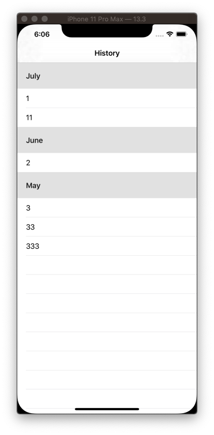
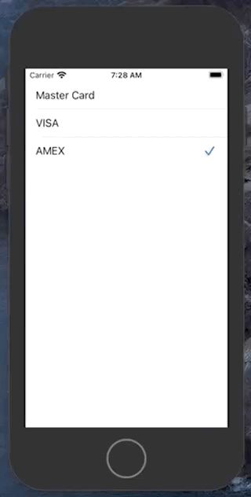
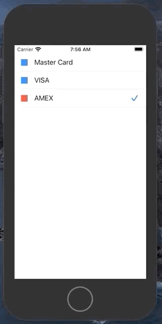
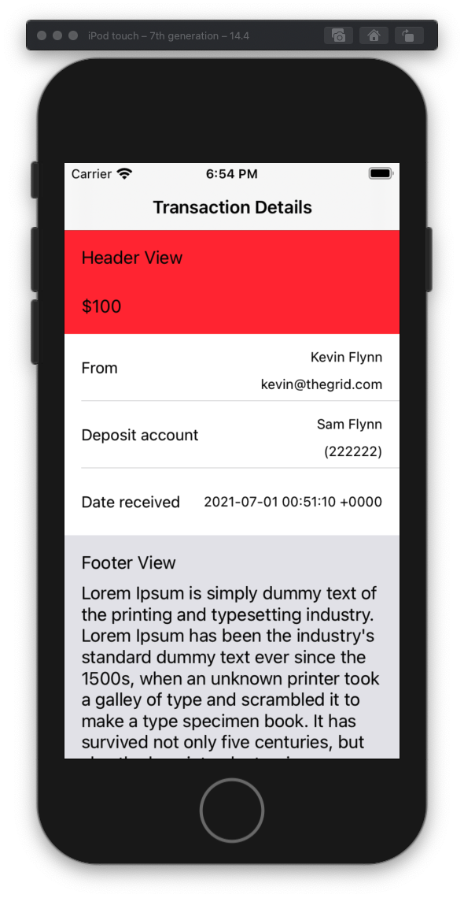

# UITableView

## Simple 1

```swift
import UIKit

struct HintData: Codable {
    var title: String
    var id: String
}

class ViewController: UIViewController {
    
    var data: [HintData] = [HintData(title: "This is a hint!", id: "1")]
    var tableView = UITableView()
    
    override func viewDidLoad() {
        super.viewDidLoad()
        tableView.delegate = self
        tableView.dataSource = self
        
        view = tableView
    }
}

extension ViewController: UITableViewDataSource, UITableViewDelegate {
    func tableView(_ tableView: UITableView, cellForRowAt indexPath: IndexPath) -> UITableViewCell {
        let cell = UITableViewCell()
        cell.textLabel?.text = data[indexPath.row].title
        return cell
    }
    
    func tableView(_ tableView: UITableView, numberOfRowsInSection section: Int) -> Int {
        return data.count
    }
}
```

## Simple 2


```swift
import UIKit

class ViewController: UIViewController {

let games = [
                "Pacman",
                "Space Invaders",
                "Space Patrol",
    ]
    
    let cellId = "cellId"

    var tableView = UITableView()

    override func viewDidLoad() {
        super.viewDidLoad()
        setupViews()
    }

    func setupViews() {
        tableView.delegate = self
        tableView.dataSource = self

        tableView.register(UITableViewCell.self, forCellReuseIdentifier: cellId)

        tableView.tableFooterView = UIView() // hide empty rows

        view = tableView
    }
}

extension ViewController: UITableViewDelegate {
    func tableView(_ tableView: UITableView, didSelectRowAt indexPath: IndexPath) {

    }
}

extension ViewController: UITableViewDataSource {
    func tableView(_ tableView: UITableView, cellForRowAt indexPath: IndexPath) -> UITableViewCell {
        let cell = tableView.dequeueReusableCell(withIdentifier: cellId, for: indexPath)

        cell.textLabel?.text = games[indexPath.row]
        cell.accessoryType = UITableViewCell.AccessoryType.disclosureIndicator

        return cell
    }

    func tableView(_ tableView: UITableView, numberOfRowsInSection section: Int) -> Int {
        return games.count
    }
}
```

# UITableViewController

```swift
import UIKit

class ViewController: UITableViewController {
    
    let games = ["Pacman",
                "Space Invaders",
                "Space Patrol",
                "Galaga",
                "Donkey Kong"]
    
    let cellId = "cellId"
    
    override func viewDidLoad() {
        super.viewDidLoad()
        setupViews()
    }
    
    func setupViews() {
        navigationItem.title = "Games"
        tableView.register(UITableViewCell.self, forCellReuseIdentifier: cellId)
    }
    
    override func tableView(_ tableView: UITableView, cellForRowAt indexPath: IndexPath) -> UITableViewCell {
        let cell = tableView.dequeueReusableCell(withIdentifier: cellId, for: indexPath)
        
        cell.textLabel?.text = games[indexPath.row]
        cell.accessoryType = UITableViewCell.AccessoryType.disclosureIndicator
        
        return cell
    }
    
    override func tableView(_ tableView: UITableView, numberOfRowsInSection section: Int) -> Int {
        return games.count
    }
    
    override func tableView(_ tableView: UITableView, didSelectRowAt indexPath: IndexPath) {
        
    }
}
```


## How to custom format viewForHeaderInSection


### Simple

If all you need is to nudge a label 16pts to the right, extend UILabel and redraw the text

```swift
class IndentedLabel: UILabel {
    override func drawText(in rect: CGRect) {
        let customRect = rect.insetBy(dx: 16, dy: 0)
        super.drawText(in: customRect)
    }
}
```

And then use like this.

```swift
    override func tableView(_ tableView: UITableView, viewForHeaderInSection section: Int) -> UIView? {

        let label = IndentedLabel()

        if section == 0 {
            label.text = "Short names"
        } else {
            label.text = "Long names"
        }

        label.backgroundColor = .lightBlue
        label.textColor = .darkBlue
        label.font = UIFont.boldSystemFont(ofSize: 16)

        return label
    }
```

### Auto Layout

If you need something more complicated, consider creating a custom view. Both here do the same thing.

```swift
    override func tableView(_ tableView: UITableView, viewForHeaderInSection section: Int) -> UIView? {

        let containerView = UIView()
        containerView.backgroundColor = .lightBlue

        let label = UILabel()
        containerView.addSubview(label)

        label.translatesAutoresizingMaskIntoConstraints = false
        label.centerYAnchor.constraint(equalTo: containerView.centerYAnchor).isActive = true
        label.leadingAnchor.constraint(equalTo: containerView.leadingAnchor, constant: 16).isActive = true

        if section == 0 {
            label.text = "Short names"
        } else {
            label.text = "Long names"
        }

        label.textColor = .darkBlue
        label.font = UIFont.boldSystemFont(ofSize: 16)

        return containerView
    }
```

Note: `containerView` doesn't need `translatesAutoresizingMaskIntoConstraints = false` because the UITable sets or draws the rect for thge section header itself.

## Headers

So `UITableViews` have headers and footers, but confusingly headers and footers can also be set via sections. Stick with headers and footers in sections (as these seem to be more common). But know that the API exists for you to create a custom `UIView` or `UITableViewCell` and set the header or footer like this.

```swift
tableView.tableHeaderView = ...
tableView.tableFooterView = ...
```

When I played with this the header and footer would be obscured if you have sections. So pick one or the other. But not both.

### Hide extra rows in footer

```swift
tableView.tableFooterView = UIView() // hide empty rows
```

### Headers in Sections

Here is how you can set the headers within a `UITableView` section.

#### Plain text

Headers and sections are really one in the same. You can tell from the API `titleForHeaderInSection`. When you only have one it's a header. But as soon as you have multiple they act more like sections.

```swift
    func tableView(_ tableView: UITableView, titleForHeaderInSection section: Int) -> String? {
        if section == 0 {
            return "Section 1"
        }
        else {
            return "Section 2"
        }
    }

    func numberOfSections(in tableView: UITableView) -> Int {
        return 2
    }
```


A similar API exists for footers.

#### Custom View

```swift

    func tableView(_ tableView: UITableView, titleForHeaderInSection section: Int) -> String? {
        return "Header title"
    }

    func tableView(_ tableView: UITableView, viewForHeaderInSection section: Int) -> UIView? {
        let greenView = UIView()

        greenView.backgroundColor = .green
        greenView.translatesAutoresizingMaskIntoConstraints = false
        greenView.heightAnchor.constraint(equalToConstant: 100).isActive = true
        greenView.widthAnchor.constraint(equalToConstant: 100).isActive = true

        return greenView
    }
}
```

## Navigation title

Sometimes you will see a nice title at the top of your table. Often that is a nav bar with a title set.

```swift
    func application(_ application: UIApplication, didFinishLaunchingWithOptions launchOptions: [UIApplication.LaunchOptionsKey: Any]?) -> Bool {
        window = UIWindow(frame: UIScreen.main.bounds)
        window?.makeKeyAndVisible()

        let navigatorController = UINavigationController(rootViewController: ViewController())
        window?.rootViewController = navigatorController

        return true
    }
```

```swift
    override func viewDidLoad() {
        super.viewDidLoad()
        setupViews()

        navigationItem.title = "Actions"
        navigationController?.navigationBar.prefersLargeTitles = true
    }
```


## Sections

Simple example of sections.




```swift
import UIKit

struct Transaction: Codable {
    let id: Int
    let type: String
    let amount: String
    let date: Date
    
    enum CodingKeys: String, CodingKey {
        case id
        case type
        case amount
        case date = "processed_at"
    }
}

struct HistorySection {
    let title: String
    let transactions: [Transaction]
}

struct HistoryViewModel {
    let sections: [HistorySection]
}

class HistoryViewController: UITableViewController {
    
    let cellId = "cellId"
    var viewModel: HistoryViewModel?
        
    override func viewDidLoad() {
        super.viewDidLoad()
        data()
        style()
    }
    
    func data() {
        let tx1 = Transaction(id: 1, type: "redeemed", amount: "1", date: Date())
        let tx11 = Transaction(id: 1, type: "redeemed", amount: "11", date: Date())

        let tx2 = Transaction(id: 1, type: "redeemed", amount: "2", date: Date())

        let tx3 = Transaction(id: 1, type: "redeemed", amount: "3", date: Date())
        let tx33 = Transaction(id: 1, type: "redeemed", amount: "33", date: Date())
        let tx333 = Transaction(id: 1, type: "redeemed", amount: "333", date: Date())
        
        let section1 = HistorySection(title: "July", transactions: [tx1, tx11])
        let section2 = HistorySection(title: "June", transactions: [tx2])
        let section3 = HistorySection(title: "May", transactions: [tx3, tx33, tx333])
        
        viewModel = HistoryViewModel(sections: [section1, section2, section3])
    }
    
    func style() {
        navigationItem.title = "History"
        tableView.register(UITableViewCell.self, forCellReuseIdentifier: cellId)
    }
}

// MARK: Data Source

extension HistoryViewController {

    override func tableView(_ tableView: UITableView, cellForRowAt indexPath: IndexPath) -> UITableViewCell {
        guard let vm = viewModel else { return UITableViewCell() }
        
        let cell = tableView.dequeueReusableCell(withIdentifier: cellId, for: indexPath)
        let section = indexPath.section
        
        let text = vm.sections[section].transactions[indexPath.row].amount
        cell.textLabel?.text = text
        
        return cell
    }

    override func tableView(_ tableView: UITableView, numberOfRowsInSection section: Int) -> Int {
        guard let vm = viewModel else { return 0 }
        return vm.sections[section].transactions.count    
    }
    
    override func tableView(_ tableView: UITableView, titleForHeaderInSection section: Int) -> String? {
        guard let vm = viewModel else { return nil }
        return vm.sections[section].title
    }
    
    override func tableView(_ tableView: UITableView, heightForHeaderInSection section: Int) -> CGFloat {
        return 60
    }
    
    override func numberOfSections(in tableView: UITableView) -> Int {
        guard let sections = viewModel?.sections else { return 0 }
        return sections.count
    }
}
```

## Custom Cell Styles

```swift
let cell = tableView.dequeueReusableCell(withIdentifier: "myCell") ?? UITableViewCell(style: .default, reuseIdentifier: "myCell")
```


## Cell Reuse

Do this is you need a cell created a specific way.

```swift
func tableView(_ tableView: UITableView, cellForRowAt indexPath: IndexPath) -> UITableViewCell {

    let offer = viewModel.offersForSelectedCategory[indexPath.row]

    let cell: ChannelAddOnsViewControllerCell

    if let existingCell = tableView.dequeueReusableCell(withIdentifier: ChannelAddOnsView.cellId) as? ChannelAddOnsViewControllerCell {
        cell = existingCell
    } else {
        cell = ChannelAddOnsViewControllerCell(style: .default, reuseIdentifier: ChannelAddOnsView.cellId)
    }

    cell.subscriptionOffer = offer

    return cell
}
```
## Accessory types

There are five different accessory types for a `UITableViewCell`.

```swift
    func tableView(_ tableView: UITableView, cellForRowAt indexPath: IndexPath) -> UITableViewCell {
        let cell = tableView.dequeueReusableCell(withIdentifier: "myCell", for: indexPath)

        cell.textLabel?.text = actionButtons[indexPath.row]

        if indexPath.row == 0 {
            cell.accessoryType = UITableViewCell.AccessoryType.none
        } else if indexPath.row == 1 {
            cell.accessoryType = UITableViewCell.AccessoryType.disclosureIndicator
        } else if indexPath.row == 2 {
            cell.accessoryType = UITableViewCell.AccessoryType.detailDisclosureButton
        } else if indexPath.row == 3 {
            cell.accessoryType = UITableViewCell.AccessoryType.checkmark
        } else if indexPath.row == 4 {
            cell.accessoryType = UITableViewCell.AccessoryType.detailButton
        }

        return cell
    }
```


## TableView Style

```swift
let tableView = UITableView(frame: .zero, style: .plain)
let tableView = UITableView(frame: .zero, style: .grouped)
```


## Editing Styles

There are two ways you can edit the rows and provide actions on a _UITableViewCell_. You can either return an array of action buttons with closures like this.

```swift
override func tableView(_ tableView: UITableView, commit editingStyle: UITableViewCell.EditingStyle, forRowAt indexPath: IndexPath) {
    if editingStyle == .delete {
        objects.remove(at: indexPath.row)
        tableView.deleteRows(at: [indexPath], with: .fade)
    } else if editingStyle == .insert {
        // Create a new instance of the appropriate class, insert it into the array, and add a new row to the table view.
    }
}
```

- [How to swipe to delete tableViewCelles](https://www.hackingwithswift.com/example-code/uikit/how-to-swipe-to-delete-uitableviewcells)

Or you can create a custom action button (like on a navbarController) and do your work via target-action there.

```swift
    lazy var addButtonItem: UIBarButtonItem = {
        let barButtonItem = UIBarButtonItem(title: "Add", style: .plain, target: self, action: #selector(addGamePressed))
        return barButtonItem
    }()

    @objc
    func addGamePressed() {
        games.append("Ms Pacman")
        let indexPath = IndexPath(row: games.count - 1, section: 0)

        tableView.beginUpdates()
        tableView.insertRows(at: [indexPath], with: .fade)
        tableView.endUpdates()
    }
```

Either way will work. More just a matter of design and whatever makes sense for your app.

## Handling Row Selection

### Selecting items from a list

[Handling Row Selection in a Table View](https://developer.apple.com/documentation/uikit/uitableviewdelegate/handling_row_selection_in_a_table_view)


```swift
import UIKit

class ViewController: UIViewController {

    struct CardItem {
        let name: String
        let isSelected: Bool
        
        init(_ name: String, _ isSelected: Bool) {
            self.name = name
            self.isSelected = isSelected
        }
    }
    
    var cardList = [
        CardItem("Master Card", false),
        CardItem("VISA", false),
        CardItem("AMEX", false),
    ]
    
    let cellId = "cellId"

    var tableView = UITableView()

    override func viewDidLoad() {
        super.viewDidLoad()
        setupViews()
    }

    func setupViews() {
        tableView.delegate = self
        tableView.dataSource = self

        tableView.register(UITableViewCell.self, forCellReuseIdentifier: cellId)
        tableView.tableFooterView = UIView() // hide empty rows

        view = tableView
    }
}

extension ViewController: UITableViewDelegate {

}

extension ViewController: UITableViewDataSource {
    func tableView(_ tableView: UITableView, cellForRowAt indexPath: IndexPath) -> UITableViewCell {

        let cell = tableView.dequeueReusableCell(withIdentifier: cellId, for: indexPath)

        let card = cardList[indexPath.row]
        cell.textLabel?.text = card.name
        
        return cell
    }

    func tableView(_ tableView: UITableView, numberOfRowsInSection section: Int) -> Int {
        return cardList.count
    }

    func tableView(_ tableView: UITableView, didSelectRowAt indexPath: IndexPath) {
        // Unselect the row, and instead, show the state with a checkmark.
        tableView.deselectRow(at: indexPath, animated: false)
        
        guard let cell = tableView.cellForRow(at: indexPath) else { return }
        
        // Update the selected item to indicate whether the user packed it or not.
        let item = cardList[indexPath.row]
        let newItem = CardItem(item.name, !item.isSelected)
        cardList.remove(at: indexPath.row)
        cardList.insert(newItem, at: indexPath.row)
        
        // Show a check mark next to packed items.
        if newItem.isSelected {
            cell.accessoryType = .checkmark
        } else {
            cell.accessoryType = .none
        }
    }
}
```

## Exclusively selecting items from a list



```swift
import UIKit

class ViewController: UIViewController {

    struct CardItem {
        let name: String
        let isSelected: Bool
        
        init(_ name: String, _ isSelected: Bool) {
            self.name = name
            self.isSelected = isSelected
        }
    }
    
    var cardList = [
        CardItem("Master Card", false),
        CardItem("VISA", false),
        CardItem("AMEX", false),
    ]
    var previouslySelectedRow = 99
    
    let cellId = "cellId"

    var tableView = UITableView()

    override func viewDidLoad() {
        super.viewDidLoad()
        setupViews()
    }

    func setupViews() {
        tableView.delegate = self
        tableView.dataSource = self

        tableView.register(UITableViewCell.self, forCellReuseIdentifier: cellId)
        tableView.tableFooterView = UIView() // hide empty rows

        view = tableView
    }
}

extension ViewController: UITableViewDelegate {

}

extension ViewController: UITableViewDataSource {
    func tableView(_ tableView: UITableView, cellForRowAt indexPath: IndexPath) -> UITableViewCell {

        let cell = tableView.dequeueReusableCell(withIdentifier: cellId, for: indexPath)

        let card = cardList[indexPath.row]
        cell.textLabel?.text = card.name
        
        return cell
    }

    func tableView(_ tableView: UITableView, numberOfRowsInSection section: Int) -> Int {
        return cardList.count
    }
    
    // exclusively selecting items from a list
    func tableView(_ tableView: UITableView, didSelectRowAt indexPath: IndexPath) {
        // Unselect the row.
        tableView.deselectRow(at: indexPath, animated: false)
        
        // Did the user tap on the previously selected row?
        if previouslySelectedRow == indexPath.row {
            return
        }

        // Remove the checkmark from the previously selected filter item.
        if let previousCell = tableView.cellForRow(at: IndexPath(row: previouslySelectedRow, section: indexPath.section)) {
            previousCell.accessoryType = .none
        }
        
        // Mark the newly selected filter item with a checkmark.
        if let cell = tableView.cellForRow(at: indexPath) {
            cell.accessoryType = .checkmark
        }
        
        // Remember this selected filter item.
        previouslySelectedRow = indexPath.row
    }
}
```

## Exclusively list custom cell



**CardCell.swift**

```swift
import UIKit

class CardCell: UITableViewCell {
    
    let onOffImageView = UIView()
    let label = UILabel()
    
    var cardItem: CardItem? {
        didSet {
            guard let cardItem = cardItem else { return }
            label.text = cardItem.name
            if cardItem.isSelected {
                onOffImageView.backgroundColor = .systemRed
            } else {
                onOffImageView.backgroundColor = .systemBlue
            }
        }
    }
    
    override init(style: UITableViewCell.CellStyle, reuseIdentifier: String?) {
        super.init(style: style, reuseIdentifier: reuseIdentifier)
        setup()
        layout()
    }
    
    required init?(coder: NSCoder) {
        fatalError("init(coder:) has not been implemented")
    }
    
    func setup() {
        onOffImageView.translatesAutoresizingMaskIntoConstraints = false
        onOffImageView.backgroundColor = .systemRed
        
        label.translatesAutoresizingMaskIntoConstraints = false
    }
    
    func layout() {
        contentView.addSubview(onOffImageView)
        contentView.addSubview(label)
        
        NSLayoutConstraint.activate([
            onOffImageView.centerYAnchor.constraint(equalTo: centerYAnchor),
            onOffImageView.leadingAnchor.constraint(equalToSystemSpacingAfter: leadingAnchor, multiplier: 2),
            onOffImageView.widthAnchor.constraint(equalToConstant: 16),
            onOffImageView.heightAnchor.constraint(equalToConstant: 16),
            
            label.centerYAnchor.constraint(equalTo: centerYAnchor),
            label.leadingAnchor.constraint(equalToSystemSpacingAfter: onOffImageView.trailingAnchor, multiplier: 2),
            trailingAnchor.constraint(equalToSystemSpacingAfter: label.trailingAnchor, multiplier: 2),
        ])
    }
}
```

**ViewController.swift**

```swift
import UIKit

struct CardItem {
    let name: String
    let isSelected: Bool
    
    init(_ name: String, _ isSelected: Bool) {
        self.name = name
        self.isSelected = isSelected
    }
}

class ViewController: UIViewController {

    var cardList = [
        CardItem("Master Card", false),
        CardItem("VISA", false),
        CardItem("AMEX", false),
    ]
    var previouslySelectedRow = 99
    
    let cellId = "cellId"

    var tableView = UITableView()

    override func viewDidLoad() {
        super.viewDidLoad()
        setupViews()
    }

    func setupViews() {
        tableView.delegate = self
        tableView.dataSource = self

        tableView.register(CardCell.self, forCellReuseIdentifier: cellId)
        tableView.tableFooterView = UIView() // hide empty rows

        view = tableView
    }
}

extension ViewController: UITableViewDelegate {

}

extension ViewController: UITableViewDataSource {
    
    func tableView(_ tableView: UITableView, cellForRowAt indexPath: IndexPath) -> UITableViewCell {
        guard let cell = tableView.dequeueReusableCell(withIdentifier: cellId, for: indexPath) as? CardCell else {
            return UITableViewCell()
        }
        cell.cardItem = cardList[indexPath.row]
        
        return cell
    }

    func tableView(_ tableView: UITableView, numberOfRowsInSection section: Int) -> Int {
        return cardList.count
    }
    
    // exclusively selecting items from a list
    func tableView(_ tableView: UITableView, didSelectRowAt indexPath: IndexPath) {
        // Unselect the row.
        tableView.deselectRow(at: indexPath, animated: false)
        
        // Did the user tap on the previously selected row?
        if previouslySelectedRow == indexPath.row {
            return
        }

        // Remove the checkmark from the previously selected row
        if let previousCell = tableView.cellForRow(at: IndexPath(row: previouslySelectedRow, section: indexPath.section)) as? CardCell {
            previousCell.accessoryType = .none
            
            // Update the previously selected card
            let previousCard = cardList[previouslySelectedRow]
            let updatedPreviousCard = CardItem(previousCard.name, false)
            previousCell.cardItem = updatedPreviousCard
        }
        
        // Mark the newly row with a checkmark.
        if let cell = tableView.cellForRow(at: indexPath) as? CardCell {
            cell.accessoryType = .checkmark
            
            // Update the current card
            let currentCard = cardList[indexPath.row]
            let updatedCurrentCard = CardItem(currentCard.name, true)
            cell.cardItem = updatedCurrentCard
        }
        
        // Remember this selected filter item.
        previouslySelectedRow = indexPath.row
    }
}
```

## Header Footer Example

This example shows how to arrange header and footer.



## Other things you can change

* [Focus style](https://developer.apple.com/documentation/uikit/uitableviewcell/focusstyle)
* [Editting style](https://developer.apple.com/documentation/uikit/uitableviewcell/1623234-editingstyle)
* [Selection style](https://developer.apple.com/documentation/uikit/uitableviewcell/1623221-selectionstyle)

### Links that help
* [Apple UITableView docs](https://developer.apple.com/documentation/uikit/uitableview)
* [Human Interface Guidelines](https://developer.apple.com/design/human-interface-guidelines/ios/views/tables)
* [Great article on how to calculate TableViewCellHeight](https://stackoverflow.com/questions/18746929/using-auto-layout-in-uitableview-for-dynamic-cell-layouts-variable-row-heights)
