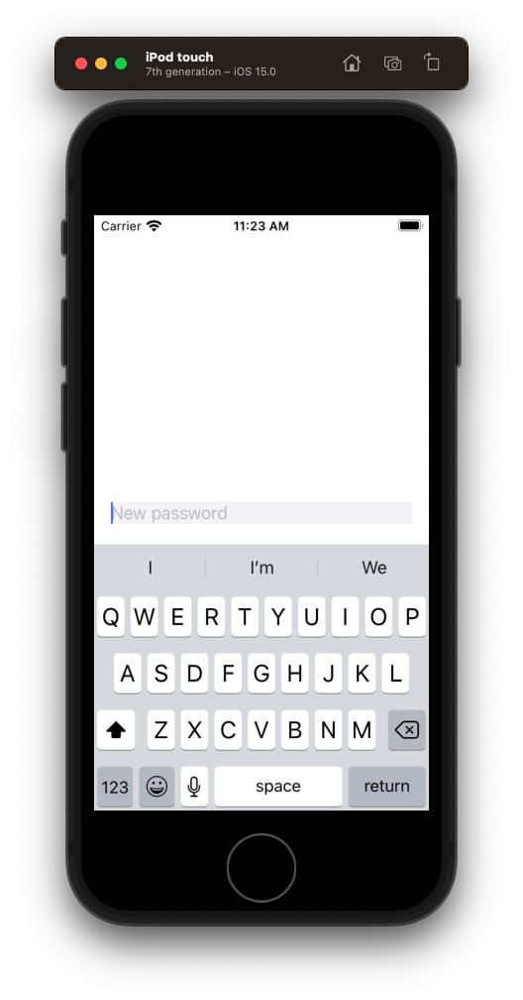
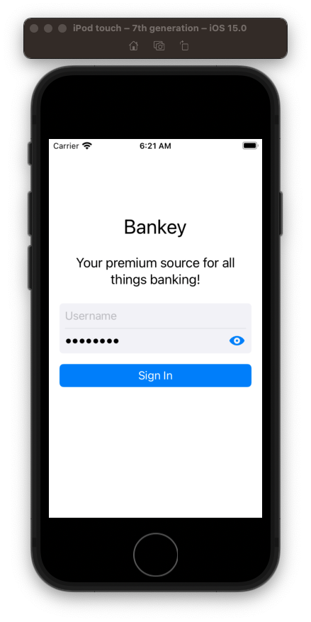

# UITextField

## Delegates



Here are all the different delegates that come with `UITextField`.

```swift

import UIKit

class ViewController: UIViewController {

    let textField = UITextField()
    
    override func viewDidLoad() {
        super.viewDidLoad()
        style()
        layout()
    }
}

extension ViewController {
    private func style() {
        textField.translatesAutoresizingMaskIntoConstraints = false
        textField.placeholder = "New password"
        textField.backgroundColor = .systemGray6
        textField.delegate = self
    }
    
    private func layout() {
        view.addSubview(textField)
        
        NSLayoutConstraint.activate([
            textField.centerYAnchor.constraint(equalTo: view.centerYAnchor),
            textField.leadingAnchor.constraint(equalToSystemSpacingAfter: view.leadingAnchor, multiplier: 2),
            view.trailingAnchor.constraint(equalToSystemSpacingAfter: textField.trailingAnchor, multiplier: 2)
        ])
    }
}

// MARK: - UITextFieldDelegate
extension ViewController: UITextFieldDelegate {
    
    // return NO to disallow editing.
    func textFieldShouldBeginEditing(_ textField: UITextField) -> Bool {
        return true
    }
    
    // became first responder
    func textFieldDidBeginEditing(_ textField: UITextField) {
        
    }
    
    // return YES to allow editing to stop and to resign first responder status.
    // return NO to disallow the editing session to end
    func textFieldShouldEndEditing(_ textField: UITextField) -> Bool {
        return true
    }

    // if implemented, called in place of textFieldDidEndEditing: ?
    func textFieldDidEndEditing(_ textField: UITextField) {
    }

    // detect - keypress
    // return NO to not change text
    func textField(_ textField: UITextField, shouldChangeCharactersIn range: NSRange, replacementString string: String) -> Bool {
        let textFieldText = textField.text ?? ""
        let newText = (textFieldText as NSString).replacingCharacters(in: range, with: string)
        print("text: \(textFieldText) newText: \(newText)")
        
        return true
    }
    
    // called when 'clear' button pressed. return NO to ignore (no notifications)
    func textFieldShouldClear(_ textField: UITextField) -> Bool {
        return true
    }
    
    // called when 'return' key pressed. return NO to ignore.
    func textFieldShouldReturn(_ textField: UITextField) -> Bool {
        textField.endEditing(true) // resign first responder
        return true
    }
}
```

## Text when return pressed

```swift
// called when 'return' key pressed. return NO to ignore.
func textFieldShouldReturn(_ textField: UITextField) -> Bool {
    textField.endEditing(true) // resign first responder
    print("Text from return: \(textField.text)")
    return true
}
```

## Detecting keypresses

Detect each keypress using the following callback.

```swift
// detect - keypress
// return NO to not change text
func textField(_ textField: UITextField, shouldChangeCharactersIn range: NSRange, replacementString string: String) -> Bool {
    let textFieldText = textField.text ?? ""
    let newText = (textFieldText as NSString).replacingCharacters(in: range, with: string)
    print("text: \(textFieldText) newText: \(newText)")
    
    return true
}
```

Note: First key press is not yet added to the word.


## Weather Search Delegate

Example delegate callback for a search textfield.

```swift
// MARK: - UITextFieldDelegate

extension WeatherViewController: UITextFieldDelegate {
    
    @objc func searchPressed(_ sender: UIButton) {
        searchTextField.endEditing(true)
    }
    
    func textFieldShouldReturn(_ textField: UITextField) -> Bool {
        searchTextField.endEditing(true)
        return true
    }
    
    // Return pressed
    func textFieldShouldEndEditing(_ textField: UITextField) -> Bool {
        if textField.text != "" {
            return true
        } else {
            textField.placeholder = "Type something"
            return false
        }
    }
    
    func textFieldDidEndEditing(_ textField: UITextField) {
        if let city = searchTextField.text {
            weatherService.fetchWeather(cityName: city)
        }
        searchTextField.text = ""
    }
}
```

## Hide password

```swift
textField.isSecureTextEntry = true
```

## Hide password with toggle image



```swift
import Foundation
import UIKit

let passwordToggleButton = UIButton(type: .custom)

extension UITextField {
    
    func enablePasswordToggle(){
        passwordToggleButton.setImage(UIImage(systemName: "eye.fill"), for: .normal)
        passwordToggleButton.setImage(UIImage(systemName: "eye.slash.fill"), for: .selected)
        passwordToggleButton.addTarget(self, action: #selector(togglePasswordView), for: .touchUpInside)
        rightView = passwordToggleButton
        rightViewMode = .always
    }
    
    @objc func togglePasswordView(_ sender: Any) {
        isSecureTextEntry.toggle()
        passwordToggleButton.isSelected.toggle()
    }
}
```

## Border Style

```swift
textField.borderStyle = .none
```


```swift
textField.borderStyle = .line
```


```swift
textField.borderStyle = .bezel
```


```swift
textField.borderStyle = .roundedRect
```


## endEditting vs resignFirstResponder

There are two ways to give up first responder:

- `textField.resignFirstResponder`
- `textField.endEditting`

Another way to dismiss the keyboard is to call `endEditting` on a `UIView` containing a `UITextField`. Which is better?

`resignFirstResponder()` is good when you know which text field has the keyboard. It’s direct. It’s efficient. Use it when you have the `UITextField` causing the keyboard to appear and you want to give it up.

`endEditing` is actually a method on the `UIView`. Use this when you don’t know who caused the keyboard to appear or you don’t have reference to the `UITextField` currenty in focus. It searches all the subviews in the view hierarchy until it finds the one holding the first responder status and then asks it to give it up. Not as efficient. But it works too (just more broadly).

## Different keyboards 

iOS lets you choose from a vareity of keyboards when accepting user input. Simply change the `keyboardType` on `UITextField` set display various kinds.


```
        textField.keyboardType = UIKeyboardType.emailAddress

//        case `default` // Default type for the current input method.
//
//        case asciiCapable // Displays a keyboard which can enter ASCII characters
//
//        case numbersAndPunctuation // Numbers and assorted punctuation.
//
//        case URL // A type optimized for URL entry (shows . / .com prominently).
//
//        case numberPad // A number pad with locale-appropriate digits (0-9, ۰-۹, ०-९, etc.). Suitable for PIN entry.
//
//        case phonePad // A phone pad (1-9, *, 0, #, with letters under the numbers).
//
//        case namePhonePad // A type optimized for entering a person's name or phone number.
//
//        case emailAddress // A type optimized for multiple email address entry (shows space @ . prominently).
```

## How to adjust view when keyboard present

When the keyboard appears, you may need to adjust your current view layout  to prevent certain elements from being obstructed.


One way to handle this is to

* create a default height constraint 
* calculate the size of the keyboard
* and then update that constraint to include the original height + the keyboard height

The other is to use [TPKeyboardAvoiding](https://github.com/michaeltyson/TPKeyboardAvoiding).

This example below shows you how to do it the manual way.

```swift
//
//  ViewController.swift
//  keyboardHeight
//
//  Created by Jonathan Rasmusson (Contractor) on 2018-07-27.
//  Copyright © 2018 Jonathan Rasmusson (Contractor). All rights reserved.
//

import UIKit

class ViewController: UIViewController {

    @IBOutlet var textField: UITextField!
    @IBOutlet var heightConstraint: NSLayoutConstraint!

    let defaultHeight = CGFloat(20)
    
    override func viewDidLoad() {
        super.viewDidLoad()
    }

    override func viewWillAppear(_ animated: Bool) {

        NotificationCenter.default.addObserver(self, selector: #selector(adjustForKeyboard), name: Notification.Name.UIKeyboardWillHide, object: nil)
        NotificationCenter.default.addObserver(self, selector: #selector(adjustForKeyboard), name: Notification.Name.UIKeyboardWillChangeFrame, object: nil)

        view.addGestureRecognizer(UITapGestureRecognizer(target: self, action: #selector(dismissKeyboard(gesture:))))
    }

    override func viewWillDisappear(_ animated: Bool) {
        NotificationCenter.default.removeObserver(self)
    }

    @objc func adjustForKeyboard(notification: Notification) {

        let userInfo = notification.userInfo!

        let keyboardScreenEndFrame = (userInfo[UIKeyboardFrameEndUserInfoKey] as! NSValue).cgRectValue
        let keyboardViewEndFrame = view.convert(keyboardScreenEndFrame, from: view.window)
        let keyboardHeight = keyboardViewEndFrame.height

        if notification.name == Notification.Name.UIKeyboardWillHide {
            heightConstraint.constant = defaultHeight
        } else {
            heightConstraint.constant = defaultHeight + keyboardHeight
        }

    }

    @objc func dismissKeyboard(gesture: UIGestureRecognizer) {
        textField?.resignFirstResponder()
    }
}
```

### Links that help
* [Apple docs](https://developer.apple.com/documentation/uikit/uitextfield?changes=_5)
* [Human Interface Guidelines](https://developer.apple.com/design/human-interface-guidelines/ios/controls/text-fields/)
