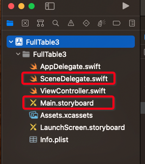
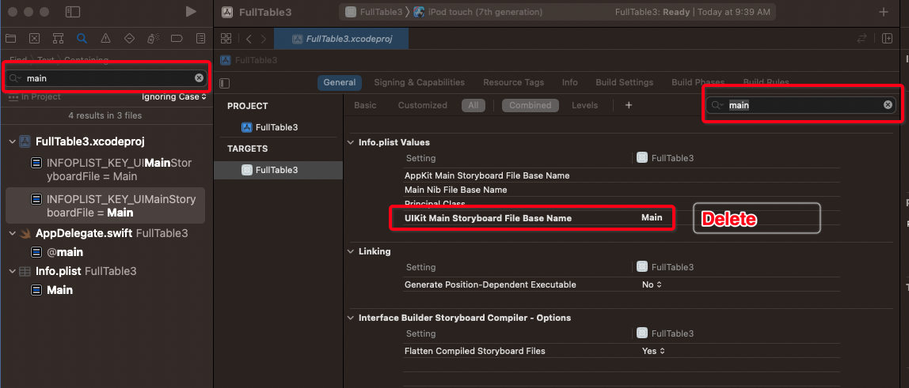
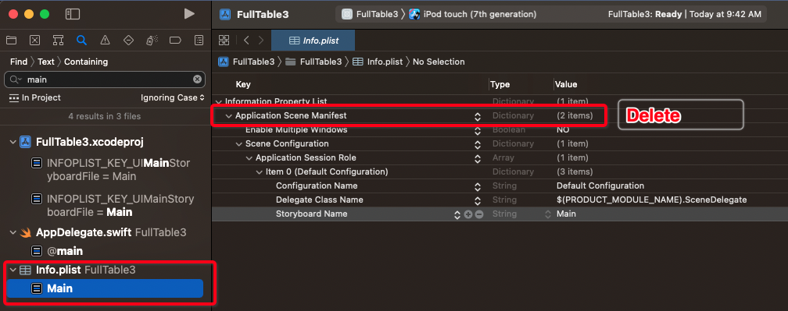
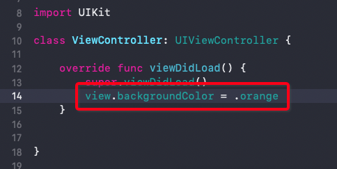
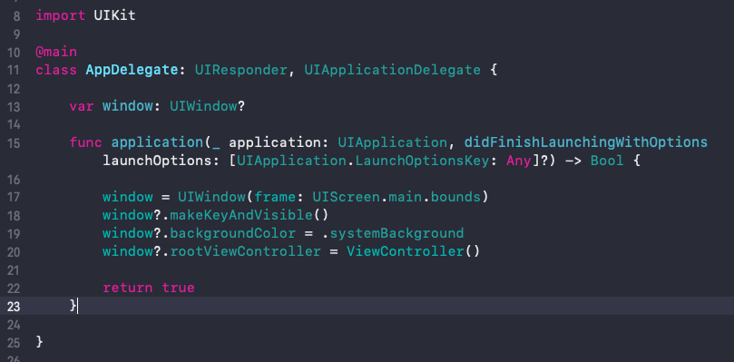
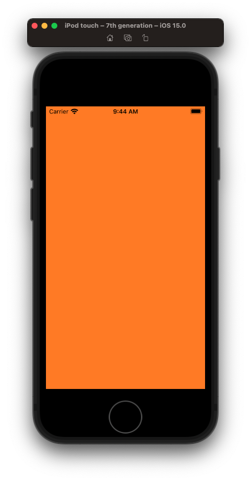

# How setup project with no storyboards

## Xcode 13







## Xcode 12

```swift
    func application(_ application: UIApplication, didFinishLaunchingWithOptions launchOptions: [UIApplication.LaunchOptionsKey: Any]?) -> Bool {

        window = UIWindow(frame: UIScreen.main.bounds)
        window?.backgroundColor = .white
        window?.makeKeyAndVisible()
        window?.rootViewController = ViewController()

        return true
    }
```
Or with navigation controller

```swift
    func application(_ application: UIApplication, didFinishLaunchingWithOptions launchOptions: [UIApplication.LaunchOptionsKey: Any]?) -> Bool {
        window = UIWindow(frame: UIScreen.main.bounds)
        window?.backgroundColor = .white
        window?.makeKeyAndVisible()

        let navigatorController = UINavigationController(rootViewController: ViewController())
        window?.rootViewController = navigatorController

        return true
    }
```

Delete the storyboard from the project.

Delete `Main storyboard file base name` entry from `Info.plist`.
